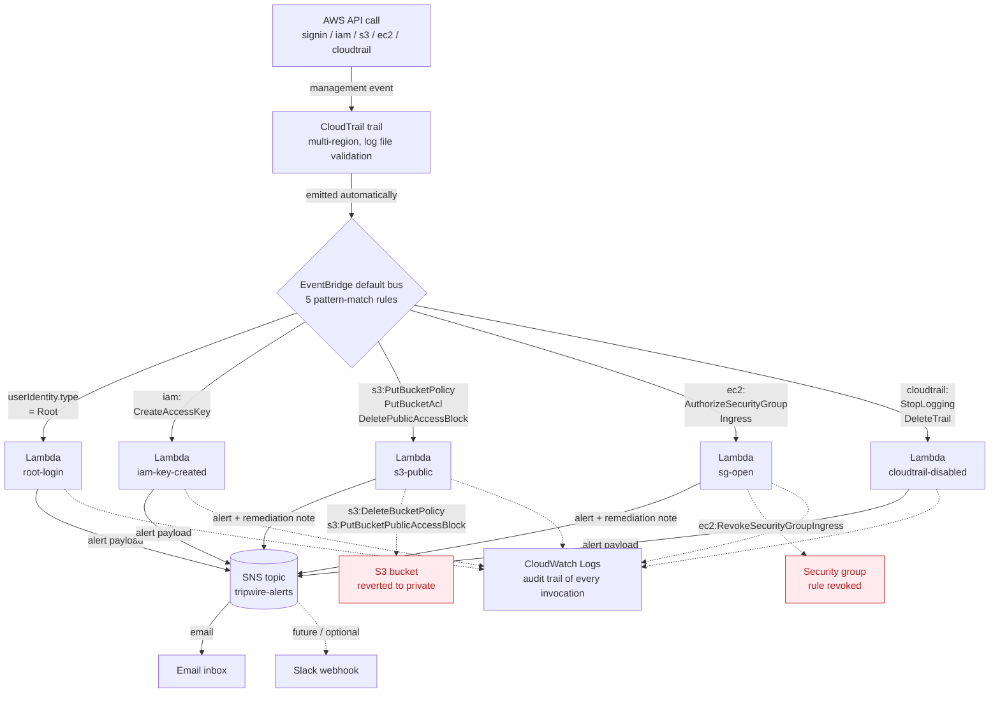

# TripWire

> A serverless detection-and-response system for the AWS control plane — sub-60-second auto-remediation on $0/month of free-tier infrastructure.


## The Problem

A medium-sized AWS account generates millions of CloudTrail events per day. Almost all of them are routine. A small fraction — root logins, IAM key creation, public S3 exposure, security groups opened to the internet, CloudTrail itself being disabled — are the exact actions documented in real cloud breaches: Capital One (2019), Scattered Spider (2023–24), UNC5537 / Snowflake (2024), Salesloft Drift / Salesforce (2025), and the ongoing ShinyHunters campaigns into 2026. The pattern repeats: legitimate-looking control-plane changes performed with stolen credentials, often at 2 AM, that disappear into the audit log unless something is specifically watching for them.

Small and mid-sized organizations rarely have a detection in place for these. Wiz, Lacework, and CrowdStrike Falcon Cloud Security cover this territory and more — but they cost tens of thousands per year. TripWire is the focused free-tier alternative: six detections wide, two of them with automatic remediation, deployed in ten minutes.

## What TripWire Does

- **Continuously monitors** the AWS control plane via CloudTrail and EventBridge, with pattern-based rules that filter millions of events down to the half-dozen that matter.
- **Alerts within seconds** on five high-risk event categories, with structured emails that answer *WHO / WHAT / WHERE / WHEN / ATT&CK / RECOMMENDED ACTION* — formatted so a responder on their phone at 2 AM can triage without opening a laptop.
- **Auto-remediates two of them** — public S3 buckets and security groups opening SSH/RDP to the internet — in under 60 seconds. Verified end-to-end on a real CloudTrail event during the build.

## Architecture



CloudTrail captures every management API call in the account and emits it onto the EventBridge default bus. Five EventBridge rules pattern-match the specific event shapes TripWire cares about and invoke a dedicated Lambda per detection within seconds. Each Lambda publishes a structured alert to SNS and, for two of the five, also calls boto3 directly to undo the dangerous change before the alert is sent.

## The Detections

| # | Detection | Trigger | Action | MITRE ATT&CK |
|---|-----------|---------|--------|--------------|
| 1 | Root account login | `ConsoleLogin` with `userIdentity.type = Root` | Alert via SNS | [T1078.004 Valid Cloud Accounts](https://attack.mitre.org/techniques/T1078/004/) |
| 2 | IAM access key created | `iam:CreateAccessKey` | Alert via SNS | [T1098.001 Additional Cloud Credentials](https://attack.mitre.org/techniques/T1098/001/) |
| 3 | S3 bucket made public | `s3:PutBucketPolicy` / `PutBucketAcl` / `DeletePublicAccessBlock` | **Auto-revert to private** + alert | [T1530 Data from Cloud Storage](https://attack.mitre.org/techniques/T1530/) |
| 4 | Security group opens 22/3389 to `0.0.0.0/0` | `ec2:AuthorizeSecurityGroupIngress` | **Auto-revoke rule** + alert | [T1190 Exploit Public-Facing Application](https://attack.mitre.org/techniques/T1190/) |
| 5 | CloudTrail disabled or deleted | `cloudtrail:StopLogging` / `DeleteTrail` / `UpdateTrail` (with log validation off) | CRITICAL alert | [T1562.008 Disable Cloud Logs](https://attack.mitre.org/techniques/T1562/008/) |

**#1 — Root account login.** AWS best practice is that nobody ever signs in as root after initial account setup. A successful root login is therefore one of the highest-signal events available. TripWire alerts and recommends rotating root credentials and reviewing the past 24 hours of CloudTrail activity. There is no auto-remediation here: the cost of accidentally locking out a legitimate root user is far higher than the cost of a brief delay before manual response.

**#2 — IAM access key created.** Creating a long-lived access key is one of the most common persistence mechanisms in real cloud-breach forensics. The alert names the actor, the target user, and the new key ID, and includes the exact CLI commands to revoke it. Auto-disabling the key was considered and rejected: a legitimate operator's new key going dead in production is harder to recover from than a brief alert.

**#3 — S3 bucket made public.** A bucket made public is the standard exfiltration pathway in the documented cluster of S3-data breaches. TripWire inspects every `PutBucketPolicy`, `PutBucketAcl`, and `DeletePublicAccessBlock` event. If the change would expose the bucket (a `"Principal": "*"` policy, an `AllUsers` ACL grant, or PAB removal), the Lambda deletes the bucket policy and re-applies all four PublicAccessBlock flags — *then* sends the alert. A `PROTECTED_BUCKETS` allowlist (carrying the CloudTrail log bucket and the CloudFormation deploy bucket) prevents TripWire from ever auto-remediating its own dependencies. The safety trade-off is deliberate: 30 seconds of inconvenience for a legitimate admin who intentionally exposed a bucket is dramatically cheaper than minutes of an open exfiltration path.

**#4 — Security group opens management ports to the internet.** Opening port 22 or 3389 to `0.0.0.0/0` is initial-access setup. TripWire revokes the offending rule via `ec2:RevokeSecurityGroupIngress` and alerts. The remediation handles both literal `0.0.0.0/0` rules and wider port ranges that happen to cover 22 or 3389 (e.g., `0–65535`). Same trade-off as #3: a legitimate bastion host should be scoped to an office IP range, not the open internet, so reverting an open-to-the-world rule is always the right default.

**#5 — CloudTrail disabled.** Disabling the audit trail is the textbook "blind the defender" maneuver that almost always precedes more destructive actions. TripWire alerts with `CRITICAL` severity and includes the exact CLI to re-enable logging. Auto-restart was deliberately not built: legitimate maintenance changes to a trail are plausible enough that fighting them in code would be the wrong default. A paged human reviews and decides.

## Proof It Works

- **17 unit tests, all passing** — covers each handler's event parser, alert formatter, and (for #3 and #4) remediation paths. See [`tests/`](tests/).
- **3 of 5 detections verified end-to-end on live CloudTrail events**:
  - **#2** (IAM key created) fired in **4 seconds** from `aws iam create-access-key` to Lambda invocation
  - **#3** (S3 made public) fired in **7 seconds**, and the throwaway public bucket was **auto-reverted to private** with all four PublicAccessBlock flags re-applied before the alert email landed
  - **#5** (CloudTrail disabled) fired in **6 seconds** from `aws cloudtrail stop-logging` to Lambda invocation
- **One real bug caught during live triggering and fixed.** Detection #3's Lambda originally requested `s3:PutPublicAccessBlock` in its IAM role; the correct IAM action name is `s3:PutBucketPublicAccessBlock`. The bucket policy was being deleted but PAB re-application was silently failing on AccessDenied because the `try/except` was swallowing the exception without logging. Discovery was only possible because the detection was tested against a real CloudTrail event, not just unit-tested in isolation. Both bugs are fixed in [commit `51936ee`](https://github.com/abrar-sarwar/tripwire/commit/51936ee) — the IAM action is corrected and the remediation path now `print()`s any exception so a future failure surfaces in CloudWatch Logs immediately.

Detections **#1** (requires actually signing in as root) and **#4** (requires creating a throwaway security group) were not exercised against live CloudTrail events during this build — their pipelines were verified by direct Lambda invocation with the fixture event, which exercises every code path except the EventBridge rule pattern itself. Pattern correctness for both was independently verified via `aws events test-event-pattern` against the documented CloudTrail event shape.

## Deploy It Yourself

```bash
# 1. Clone
git clone https://github.com/abrar-sarwar/tripwire.git
cd tripwire

# 2. Configure AWS CLI (https://docs.aws.amazon.com/cli/latest/userguide/getting-started-quickstart.html)
aws sts get-caller-identity   # should return your account ID

# 3. Deploy — bootstrap commands + CloudFormation stack
./scripts/deploy.sh

# 4. Confirm the SNS subscription email AWS sends, then fire a synthetic event:
./scripts/test-detection.sh
```

An alert email titled **`[TripWire] HIGH - Root login (Success)`** should land within 30 seconds. The repo includes fixtures for every detection in [`tests/fixtures/`](tests/fixtures/) — point `test-detection.sh` at any of them to fire a different detection.

**Tear it all down:**

```bash
./scripts/teardown.sh
```

The teardown script removes Lambdas, IAM roles, EventBridge rules, and the SNS topic. It deliberately does **not** remove CloudTrail or the CloudTrail S3 bucket — destroying audit history on a teardown is exactly the failure mode TripWire is designed to detect, so the bootstrap resources stay.

## Cost

Within the AWS Always Free tier on a quiet account:

| Service | Usage | Free tier |
|---|---|---|
| CloudTrail management trail | 1 trail | First trail free |
| Lambda | <1,000 invocations / month expected | 1,000,000 / month |
| SNS email | <100 emails / month expected | 1,000 / month |
| EventBridge | default bus, AWS-source events only | Free |
| S3 (CloudTrail logs) | <1 GB / month | 5 GB |
| CloudWatch Logs | <50 MB / month | 5 GB |

**Total ongoing cost: $0/month.** GuardDuty (which would have powered a sixth detection — see *Future Work*) is the only chargeable AWS service in this design space and is explicitly out of scope.

## What TripWire Doesn't Do

Deliberate scope choices, not missing features:

- No workload protection — no EC2 agent, no container scanning, no malware detection
- No identity hygiene enforcement — does not require MFA, does not rotate keys
- No vulnerability management — no CVE scanning
- No compliance reporting — does not produce SOC 2 or PCI evidence
- Single-account, single-region only (us-east-1) — no organization or multi-region support
- No ML or behavioral analytics — every detection is deterministic pattern matching
- No threat intelligence enrichment beyond what GuardDuty would provide

Each of those is a real product category served by mature commercial tools. TripWire stays small and sharp: five detections, two remediations, one region, zero ongoing cost.

## Future Work

- **Detection #6: GuardDuty findings.** Originally in scope but deferred during the build — the AWS account threw `SubscriptionRequiredException` and needs a one-time Console click at the GuardDuty console to subscribe before the API will respond. The Lambda is ~30 lines and the EventBridge rule pattern is `{"source": ["aws.guardduty"], "detail-type": ["GuardDuty Finding"]}`. The implementation plan in [`docs/superpowers/plans/2026-05-11-tripwire.md`](docs/superpowers/plans/2026-05-11-tripwire.md) (Task 11) has the full handler code ready to drop in.
- **Multi-region via CloudFormation StackSets.** Today's stack deploys to us-east-1 only; a StackSet would replicate the detection Lambdas to every region the account uses.
- **A lightweight dashboard.** A CloudWatch dashboard or simple S3-hosted static page summarizing the last N alerts and the auto-remediation success rate, built on top of the existing CloudWatch Logs.

## License

All rights reserved. This repository is published as portfolio material; please contact the author before reusing in your own work.

## Author

**Abrar Tahir Sarwar**

- GitHub: [@abrar-sarwar](https://github.com/abrar-sarwar)
- LinkedIn: [linkedin.com/in/abrar-sarwar](https://www.linkedin.com/in/abrar-sarwar)
- Related project: [GLINT](https://github.com/abrar-sarwar/glint)
